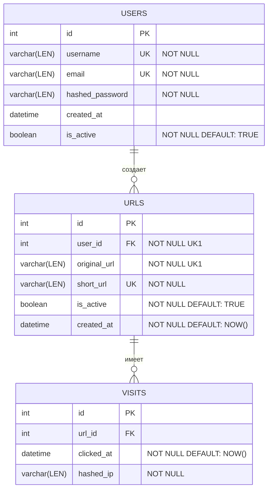

# Схема Базы Данных (ER-диаграмма)

## Описание таблиц

### Таблица `USERS` (Пользователи)

Хранит информацию о зарегистрированных пользователях системы.

- `id` — уникальный идентификатор пользователя (Primary Key).
- `username` — имя пользователя (уникальное). **Макс. длина строки: 16**
- `email` — электронная почта (уникальная). **Макс. длина строки: 255**
- `hashed_password` — хэш пароля. **Макс. длина строки: 60**
- `created_at` — дата и время регистрации пользователя.
- `is_active` — статус аккаунта (используется для блокировки/мягкого удаления).

### Таблица `URLS` (Ссылки)

Хранит созданные пользователями короткие ссылки.

- `id` — уникальный идентификатор записи (Primary Key).
- `user_id` — ID владельца ссылки (Foreign Key).
- `original_url` — исходный длинный URL-адрес. **Макс. длина строки: 4096**
- `short_url` — сгенерированный уникальный токен (короткий ID). **Макс. длина строки: 6**
- `is_active` — флаг мягкого удаления. Если `False`, ссылка недоступна (возвращает 404/410).
- `created_at` — дата и время сокращения ссылки.

> **Важно (`UK1`)**: Комбинация полей `(user_id, original_url)` имеет уникальное ограничение `UniqueConstraint`, чтобы запретить дублирование ссылок у одного и того же пользователя.

### Таблица `VISITS` (Статистика переходов)

Собирает аналитику по каждому клику на короткие ссылки авторизованных пользователей.

- `id` — уникальный идентификатор перехода (Primary Key).
- `url_id` — ID ссылки, по которой перешли (Foreign Key).
- `clicked_at` — точное дата и время клика.
- `hashed_ip` — хэшированный или анонимизированный IP-адрес посетителя. **Макс. длина строки: [указать длину]**
