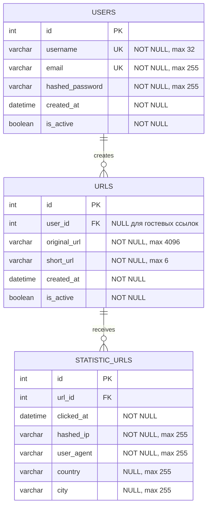

# Схема базы данных

## `users`

- `id` — первичный ключ.
- `username` — уникальное имя пользователя, максимум 32 символа.
- `email` — уникальный email, максимум 255 символов.
- `hashed_password` — bcrypt-хэш пароля, максимум 255 символов.
- `created_at` — дата регистрации.
- `is_active` — флаг активности пользователя.

## `urls`

- `id` — первичный ключ.
- `user_id` — внешний ключ на `users.id`, может быть `NULL` для гостевых ссылок.
- `original_url` — исходный URL, максимум 4096 символов.
- `short_url` — короткий Base62-ключ длиной 6 символов.
- `created_at` — дата создания.
- `is_active` — флаг мягкого удаления.
- `(user_id, original_url)` — уникальное ограничение для ссылок пользователя.

Гостевые ссылки не записываются в PostgreSQL и живут в Redis 24 часа. Пользовательские ссылки сохраняются в PostgreSQL и кэшируются в Redis.

## `statistic_urls`

- `id` — первичный ключ.
- `url_id` — внешний ключ на `urls.id`, удаляется каскадно.
- `clicked_at` — время перехода.
- `hashed_ip` — SHA-256 хэш IP с солью, исходный IP не сохраняется.
- `user_agent` — User-Agent клиента.
- `country`, `city` — данные geo API, могут быть `NULL`.

Статистика создаётся Celery worker после redirect. Запрос к внешнему geo API ограничен Celery rate limit `3/s` на worker.

## Redis

Redis не является частью ERD. Он используется для:

- хранения гостевых коротких ссылок;
- кэширования пользовательских ссылок;
- блокировок email и username при регистрации;
- брокера Celery в отдельной Redis database.
